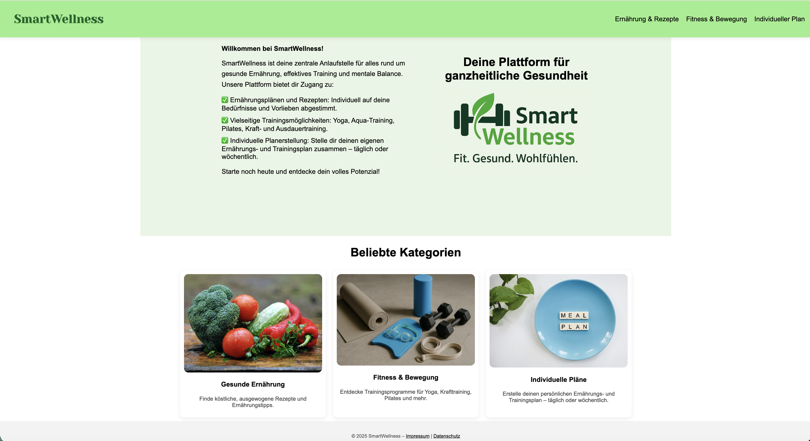
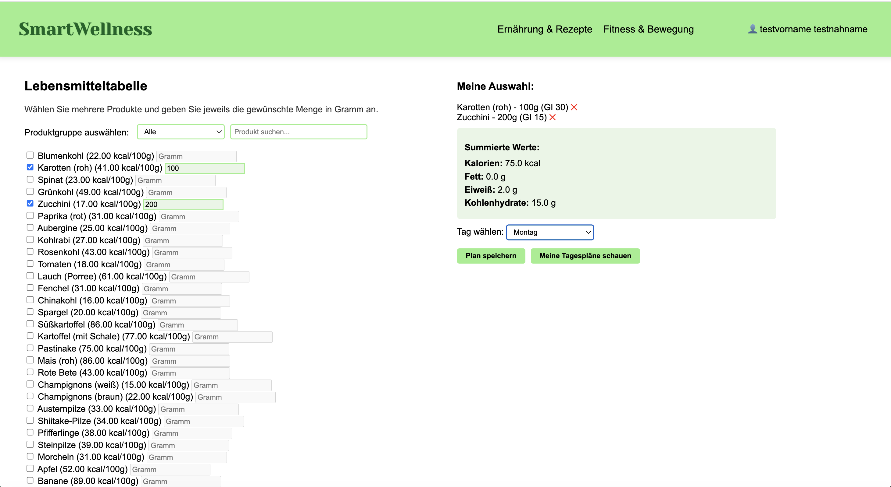
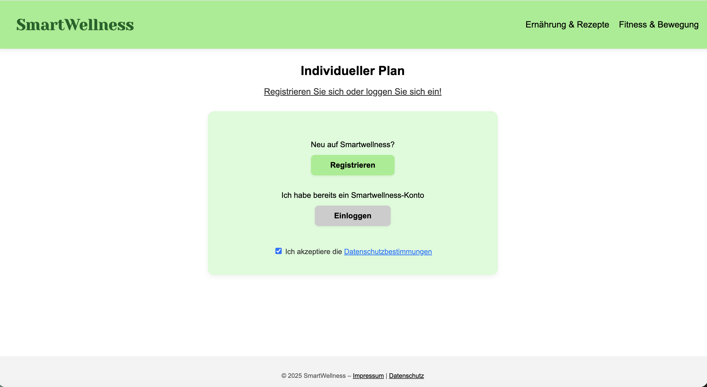
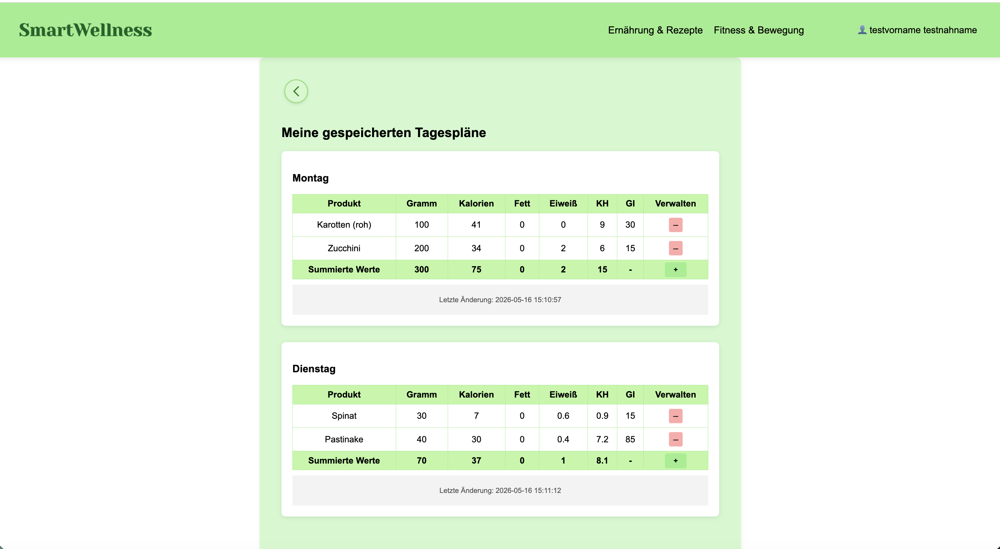

# Projekt Titel

**SmartWellness Web**  
(Mein Webprogrammierungsprojekt im Rahmen des Wirtschaftsinformatik-Studiums)

# Beschreibung

SmartWellness Web ist eine webbasierte Gesundheitsplattform für gesunde Ernährung, Fitness & Bewegung sowie individuelle Tagespläne. Die Anwendung wurde mit HTML, CSS, JavaScript, PHP und MySQL entwickelt und lokal über XAMPP umgesetzt.

## Ernährungsangebote

In diesem Bereich verlinkt SmartWellness auf externe Plattformen mit Rezepten, Ernährungstipps und gesundheitsbezogenen Informationen. Die Webseite dient als übersichtliche Sammlung vertrauenswürdiger Anbieter und unterstützt Nutzerinnen und Nutzer bei einer ausgewogenen Ernährung.

## Fitness & Bewegung

SmartWellness präsentiert verschiedene externe Anbieter aus den Bereichen Fitnessstudio, Yoga, Pilates, Muskeltraining und Aquatraining. Über eine kachelbasierte Benutzeroberfläche gelangen Nutzer direkt zu den jeweiligen Webseiten der Anbieter und Trainingsangebote.

## Personalisierte Ernährungspläne

Registrierte Nutzer können individuelle Tagespläne erstellen und verwalten. Lebensmittel werden aus einer Datenbank ausgewählt und automatisch hinsichtlich Kalorien, Fett, Eiweiß, Kohlenhydraten und glykämischem Index berechnet. Die Pläne können gespeichert, bearbeitet und erneut angezeigt werden.
# Features

- **Moderne Benutzeroberfläche mit HTML, CSS und JavaScript**
  - Responsive und übersichtliche Weboberfläche
  - Kachelbasierte Darstellung von Ernährungs- und Fitnessbereichen
  - Benutzerfreundliche Navigation zwischen den Hauptseiten

- **Benutzerregistrierung und Login**
  - Registrierung neuer Nutzer über PHP und MySQL
  - Login-System mit Sessions
  - Passwortspeicherung mit Hashing

- **Individuelle Ernährungspläne**
  - Auswahl von Lebensmitteln aus Datenbank
  - Dynamisches Hinzufügen und Entfernen von Produkten
  - Speicherung persönlicher Tagespläne

- **Automatische Nährwertberechnung**
  - Berechnung von:
    - Kalorien
    - Fett
    - Eiweiß
    - Kohlenhydraten
    - Glykämischem Index
  - Sofortige Aktualisierung ohne Seitenreload

- **Dynamische Datenverarbeitung**
  - Nutzung von JavaScript fetch()
  - FormData-Übertragung
  - JSON-basierte Antworten zwischen Frontend und Backend

- **PHP-Backend**
  - Verarbeitung von Formularen
  - Datenbankabfragen mit Prepared Statements
  - CRUD-Operationen für Tagespläne und Produkte

- **MySQL-Datenbank**
  - Speicherung von:
    - Benutzerdaten
    - Lebensmitteln
    - Tagesplänen
  - Flexible Speicherung von Produktlisten als JSON

- **Externe Gesundheits- und Fitnessplattformen**
  - Verlinkung vertrauenswürdiger Anbieter
  - Ernährungs- und Rezeptplattformen
  - Fitness-, Yoga- und Aquatraining-Angebote

- **Datenschutz und Sicherheit**
  - Passwort-Hashing
  - Schutz vor SQL-Injection
  - Datenschutzerklärung und Impressum integriert

---

# Architektur & Tech Stack

| Bereich | Technologie / Bibliothek | Zweck |
|---|---|---|
| Frontend | HTML5 | Struktur der Webseiten |
| Styling | CSS3 | Design und responsive Oberfläche |
| Interaktivität | JavaScript | Dynamische Benutzerinteraktionen |
| Datenübertragung | fetch(), FormData, JSON | Asynchrone Kommunikation |
| Backend | PHP | Verarbeitung von Formularen und Daten |
| Datenbank | MySQL | Speicherung von Nutzerdaten und Plänen |
| Entwicklungsumgebung | XAMPP | Lokaler Apache- und MySQL-Server |
| Sicherheit | password_hash(), Prepared Statements | Schutz von Benutzerdaten |
| Datenstruktur | JSON | Speicherung von Tagesplänen |
| Design & Planung | Figma, Canva | UI-Planung und Prototyping |
| Versionsverwaltung | Git & GitHub | Projektverwaltung und Veröffentlichung |
# Screenshots / Demo

Hier ein kurzer Einblick in die SmartWellness-Webanwendung:

| Home | Ernährungsplan |
|------|----------------|
|  |  |

| Registrierung | Tagesplan |
|---------------|-----------|
|  |  |

- **Home:** Startseite mit Begrüßung, Navigation und Einstieg in die Hauptbereiche.
- **Ernährungsplan:** Interaktiver Planer mit Produktauswahl und automatischer Nährwertberechnung.
- **Registrierung:** Benutzerregistrierung und Login-System für persönliche Funktionen.
- **Tagesplan:** Anzeige gespeicherter Tagespläne mit ausgewählten Lebensmitteln und berechneten Nährwerten.

# Getting Started / Installation

## Voraussetzungen

- XAMPP
- Apache Web Server
- MySQL
- Browser, z. B. Chrome
- Git optional
- VS Code optional

## 1. Projekt in XAMPP ablegen

Das Projekt muss im `htdocs`-Ordner von XAMPP liegen.

Beispiel auf macOS:

```text
/Applications/XAMPP/xamppfiles/htdocs/SmartWellness
```

## 2. XAMPP starten

XAMPP öffnen und folgende Server starten:

- Apache Web Server
- MySQL Database

## 3. Datenbank vorbereiten

Die Anwendung nutzt eine MySQL-Datenbank für Benutzer, Lebensmittel und Tagespläne.

Die Datenbank kann über phpMyAdmin geöffnet werden:

```text
http://localhost/phpmyadmin
```

## 4. Webanwendung öffnen

Im Browser aufrufen:

```text
http://localhost/SmartWellness
```

oder direkt:

```text
http://localhost/SmartWellness/index.html
```

# Usage & Testing

## Usage

Nach dem Start der Webanwendung können Nutzer zwischen mehreren Hauptbereichen navigieren:

- **Ernährungsangebote:** Zugriff auf externe Webseiten mit Rezepten und Ernährungstipps.
- **Fitness & Bewegung:** Übersicht verschiedener Anbieter für Fitnessstudio, Yoga, Pilates, Muskeltraining und Aquatraining.
- **Individuelle Tagespläne:** Interaktiver Planer mit Lebensmittelauswahl, Mengenangaben und automatischer Nährwertberechnung.
- **Benutzerkonto:** Registrierung, Login und persönlicher Nutzerbereich.

Die Anwendung speichert Benutzerdaten, Lebensmittel und Tagespläne lokal in einer MySQL-Datenbank. Die Kommunikation zwischen Frontend und Backend erfolgt teilweise dynamisch über `fetch()`, `FormData` und JSON.

## Testing

Das Projekt wurde während der Entwicklung manuell getestet.

Getestet wurden insbesondere:

- Registrierung und Login
- Session-Verwaltung
- Anzeige persönlicher Nutzerdaten
- Laden von Lebensmitteln aus der Datenbank
- Hinzufügen und Löschen von Produkten
- Automatische Berechnung von Kalorien und Nährwerten
- Speichern und Anzeigen von Tagesplänen
- Navigation zwischen den Hauptseiten
- Darstellung von Impressum und Datenschutzerklärung

Zusätzlich wurden Fehler mithilfe von Browser-Konsole, PHP-Ausgaben und schrittweisem Testen analysiert und behoben.

# Project Structure

Die Projektstruktur ist so aufgebaut, dass **Frontend**, **Backend**, **Datenbankzugriff**, **Bilder/Ressourcen** und **rechtliche Seiten** klar voneinander getrennt sind. Dadurch bleibt das Projekt übersichtlich, verständlich und gut wartbar.

## Überblick der logischen Bereiche

- **Frontend:** HTML-Seiten für Startseite, Ernährung, Fitness, Login, Registrierung und Tagespläne
- **Styling:** Zentrale CSS-Datei für Layout, Farben, Kacheln und responsive Darstellung
- **Interaktivität:** JavaScript für dynamische Produktauswahl, Berechnungen und Kommunikation mit PHP
- **Backend:** PHP-Dateien für Registrierung, Login, Sessions, Datenbankabfragen und Tagesplanverwaltung
- **Datenbank:** MySQL zur Speicherung von Benutzern, Lebensmitteln und Tagesplänen
- **Ressourcen:** Bilder, Logos, Screenshots und weitere Medien

## Wichtige Dateien und Ordner

```text
smartwellness-web/
├── index.html
├── gesunde_ernaehrung.html
├── fitness_bewegung.html
├── ernaehrungsplan.html
├── login.html
├── register.html
├── meinkonto.html
├── impressum.html
├── datenschutz.html
├── style.css
├── ernaehrungsplan.js
├── login.php
├── register.php
├── logout.php
├── session_user.php
├── speichere_plan.php
├── lade_lebensmittel.php
├── lade_produkte.php
├── produkt_hinzufuegen.php
├── produkt_loeschen.php
├── tage_anzeigen.php
├── update_user.php
├── Image/
├── Image Fitness/
├── images etc/
```

## HTML-Seiten

Die HTML-Dateien bilden die sichtbaren Seiten der Webanwendung.

### `index.html`

Startseite der Anwendung. Sie enthält den Einstieg in die Hauptbereiche der Plattform und führt Nutzer zu Ernährung, Fitness und individuellen Plänen.

### `gesunde_ernaehrung.html`

Seite für Ernährungsangebote. Hier werden externe Plattformen für Rezepte, Ernährungstipps und gesundheitsbezogene Informationen dargestellt und verlinkt.

### `fitness_bewegung.html`

Seite für Fitness & Bewegung. Sie zeigt externe Anbieter aus den Bereichen Fitnessstudio, Yoga, Pilates, Muskeltraining und Aquatraining.

### `ernaehrungsplan.html`

Zentrale Seite für die Erstellung individueller Tagespläne. Nutzer können Lebensmittel auswählen, Mengen eingeben und Nährwerte automatisch berechnen lassen.

### `login.html` und `register.html`

Seiten für Anmeldung und Registrierung von Nutzern.

### `meinkonto.html`

Persönlicher Nutzerbereich. Dort können angemeldete Nutzer ihre Daten und gespeicherten Informationen einsehen.

### `impressum.html` und `datenschutz.html`

Rechtliche Informationsseiten mit Impressum und Datenschutzerklärung.

## Styling

### `style.css`

Zentrale CSS-Datei des Projekts. Sie definiert Layout, Farben, Abstände, Kacheln, Buttons, Tabellen und die allgemeine visuelle Gestaltung der Webanwendung.

## JavaScript

### `ernaehrungsplan.js`

Diese Datei steuert die dynamische Logik des Ernährungsplaners.

Wichtige Aufgaben:

- Produkte dynamisch laden
- Lebensmittel auswählen
- Grammangaben erfassen
- Kalorien und Nährwerte berechnen
- Produkte hinzufügen oder löschen
- Inhalte ohne Seiten-Neuladen aktualisieren
- Kommunikation mit PHP über `fetch()`, `FormData` und JSON

## PHP-Backend

Die PHP-Dateien übernehmen die serverseitige Verarbeitung und die Kommunikation mit der MySQL-Datenbank.

### `register.php`

Verarbeitet die Registrierung neuer Nutzer und speichert Benutzerdaten sicher in der Datenbank.

### `login.php`

Prüft Login-Daten und startet eine Session für angemeldete Nutzer.

### `logout.php`

Beendet die aktive Session und meldet den Nutzer ab.

### `session_user.php`

Liefert Informationen über den aktuell angemeldeten Nutzer.

### `lade_lebensmittel.php`

Lädt Lebensmittel aus der Datenbank und stellt sie für den Ernährungsplaner bereit.

### `lade_produkte.php`

Lädt gespeicherte Produkte bzw. Einträge für die Tagesplanverwaltung.

### `produkt_hinzufuegen.php`

Fügt ein ausgewähltes Produkt zu einem Tagesplan hinzu.

### `produkt_loeschen.php`

Löscht ein Produkt aus einem Tagesplan.

### `speichere_plan.php`

Speichert den vollständigen Tagesplan eines Nutzers.

### `tage_anzeigen.php`

Zeigt gespeicherte Tagespläne an.

### `update_user.php`

Aktualisiert Nutzerdaten im persönlichen Bereich.

## Ressourcen und Bilder

### `Image/`

Enthält Bilder und Logos für den Bereich Ernährung.

### `Image Fitness/`

Enthält Bilder und Logos für den Bereich Fitness & Bewegung.

### `images etc/`

Enthält zusätzliche Projektbilder, CSV-Dateien, Hintergrundbilder und sonstige Ressourcen.


## Datenfluss

Der Datenfluss funktioniert vereinfacht so:

1. Nutzer interagiert mit einer HTML-Seite.
2. JavaScript verarbeitet Eingaben und sendet Daten über `fetch()` oder `FormData`.
3. PHP empfängt die Anfrage.
4. PHP liest oder schreibt Daten in die MySQL-Datenbank.
5. Die Antwort wird als JSON zurückgegeben.
6. JavaScript aktualisiert die Oberfläche dynamisch.

## Wichtige Begriffe

- **Frontend:** Sichtbarer Teil der Webanwendung im Browser
- **Backend:** Serverseitige Logik mit PHP
- **Datenbank:** Speicherung von Nutzern, Lebensmitteln und Tagesplänen in MySQL
- **Session:** Technische Verwaltung eines eingeloggten Nutzers
- **JSON:** Datenformat für flexible Speicherung und Übertragung
- **FormData:** JavaScript-Objekt zur Übertragung von Formulardaten
- **fetch():** JavaScript-Funktion für asynchrone Serveranfragen
- **Prepared Statements:** Sichere Methode zur Datenbankabfrage gegen SQL-Injection

# Contributing

Beiträge und Verbesserungsvorschläge für das Projekt sind willkommen.

Falls du Änderungen oder neue Funktionen hinzufügen möchtest, kannst du wie folgt vorgehen:

1. Repository forken
2. Eigenen Branch erstellen
3. Änderungen durchführen
4. Änderungen committen
5. Änderungen auf GitHub pushen
6. Pull Request erstellen

Beispiel:

```bash
git checkout -b feature/neues-feature
git commit -m "Neue Funktion hinzugefügt"
git push origin feature/neues-feature
```

Bitte achte darauf:

- Bestehende Code-Struktur beizubehalten
- Saubere und verständliche Commit-Nachrichten zu schreiben
- HTML, CSS, JavaScript und PHP konsistent zu formatieren
- Neue Änderungen vor dem Hochladen lokal zu testen

# License

Dieses Projekt wurde im Rahmen eines Hochschulprojekts erstellt.

Die Nutzung zu Lern-, Demonstrations- und Weiterbildungszwecken ist erlaubt. Externe Bilder, Logos und verlinkte Inhalte gehören den jeweiligen Eigentümern.

# Acknowledgements / Resources

Dieses Projekt wurde mithilfe verschiedener Technologien, Frameworks und Ressourcen umgesetzt.

## Verwendete Technologien

- HTML5
- CSS3
- JavaScript
- PHP
- MySQL
- XAMPP

## Externe Ressourcen und Plattformen

- phpMyAdmin  
  https://www.phpmyadmin.net/

- XAMPP  
  https://www.apachefriends.org/

- MDN Web Docs  
  https://developer.mozilla.org/

- PHP Documentation  
  https://www.php.net/docs.php

- MySQL Documentation  
  https://dev.mysql.com/doc/

## Inspiration und unterstützende Inhalte

Die Bereiche Ernährung und Fitness enthalten Verlinkungen zu externen Plattformen und Informationsseiten, die ausschließlich zu Demonstrations- und Lernzwecken verwendet werden.

Ein besonderer Dank gilt den Entwicklern, Communities und Dokumentationen hinter den verwendeten Technologien und Tools.
